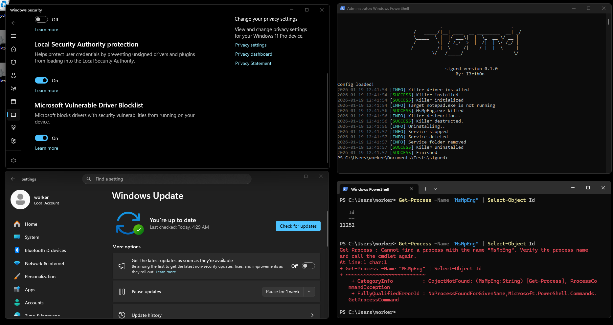
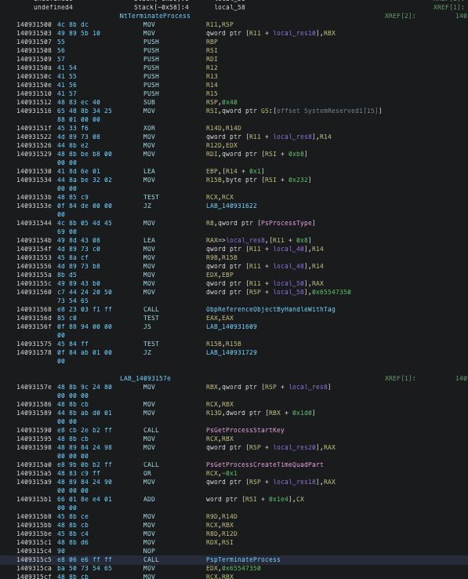
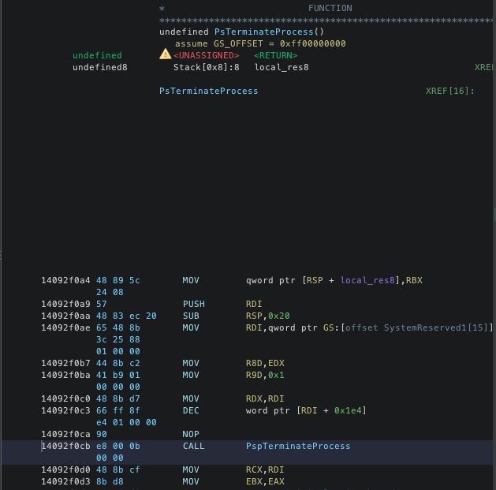
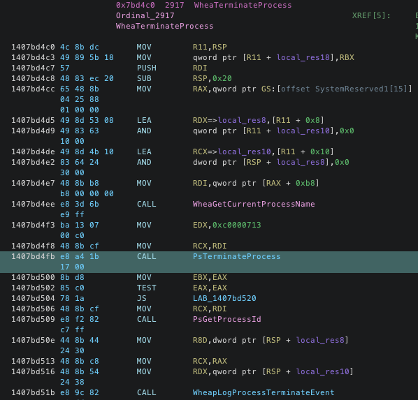

<div>


<h1>Sigurd</h1>

<p>Sigurd <i>(Old Norse: Sigurðr)</i> was a legendary Norse hero who killed the dragon Fafnir and possessed the cursed treasure. <p>

<div align="center">


</div>
</div>

<div style="clear: both;"></div>

## Overview
`Sigurd` is a BYOVD (aka Bring Your Own Vulnerable Driver) exploitation tool, made to kill processes. This tool allow you to prepare custom config(toml or json), or config it on run using TUI, making it easy to use. It also allow you to exploit multiply drivers, without carrying them around (you choose what to include at compile time). 

> [!WARNING]
> This tool was created for authorized security research and testing only. The authors and distributors accept no liability for misuse. Before using it, make sure you have lawful authorization and know what are you doing. Happy pwning!

### Table of content

- [Details](#details)
- [Building guide](#build)
- [Working demo](#demo)
- [Drivers](#drivers)
    - [Throttle Stop](#throttle-stop)
    - [Other driver](#other)
- [Contribution guide](#contribution)
- [Creds](#creds)

## Details
BYOVD technique implies installing a vulnerable and signed driver on system, in order to exploit it's known vulnerability to gain privileges, read system secrets or (in our case) - kill processes. You can read more about it at [Microsoft Security Experts Blog](https://techcommunity.microsoft.com/blog/microsoftsecurityexperts/strategies-to-monitor-and-prevent-vulnerable-driver-attacks/4103985).

This tool is made to be extended, and quicky implement new driver usage. For now it include these drivers:
 - ThrottleStop.sys ([CVE-2025-7771](https://nvd.nist.gov/vuln/detail/CVE-2025-7771))
 - K7RKScan.sys ([CVE-2025-1055](https://nvd.nist.gov/vuln/detail/CVE-2025-1055))
 - BdApiUtil6.sys ([CVE-2024-51324](https://nvd.nist.gov/vuln/detail/CVE-2024-51324))
 - wsftprm.sys ([LOL Drivers](https://www.loldrivers.io/drivers/30e8d598-2c60-49e4-953b-a6f620da1371/))
 - ksapi64.sys ([LOL Drivers](https://www.loldrivers.io/drivers/fb36ebc6-fdc5-42eb-929b-a07e00c5b9db/)) 

You find some details and links to articles about used drivers in [Drivers](#drivers) section.

## Build

All you need is lastest rust tool chain on you Windows machine (_or on any other machine, in case you know what are you doing_). You can find the standalone installers [here](https://forge.rust-lang.org/infra/other-installation-methods.html#standalone-installers). 

After installing rust toolchain, just clone the repository and enter project directory:
```shell
git clone https://github.com/I3r1h0n/Sigurd
cd Sigurd/sigurd
```

Now it all depends on what drivers you want to use. You can include only desired ones, by changing the set of cargo features. Below is an example build command, with basic set of drivers and no trace messages:
```shell
cargo build --release --no-default-features --features "throttlestop bdapiutil64 k7rkscan wsftprm"
```

After build is finished, you can find binary in `/sigurd/target/release` folder.

## Demo

Usage is pretty simple. Below is the help output. 
```shell
> .\sigurd.exe --help
BYOVD technique

Usage: sigurd.exe [OPTIONS]

Options:
  -c, --config <CONFIG>                Path to .toml config file
      --config-string <CONFIG_STRING>  TOML configuration as a quoted string
  -s, --silent                         Run app without interface
  -h, --help                           Print help
  -V, --version                        Print version
```

Default config may look like this:
```toml
driver_name = "ThrottleStop"
installation_path = 'C:\ProgramData'
victim_processes = [
    "notepad.exe",
]
continuous = false
uninstall = true
```

You can:
1. Save it next to executable as `Config.toml`, 
2. Save it somewhere else, and provide it's path via `--config`
3. Convert it to valid JSON and pass it as `--config-string`
4. Or start without any config and configure Sigurd on run 

Silent mode allows you to run without starting a Terminal User Interface. Just provide a valid config, and sigurd will use it as is.

Here is the demo showing it use the ThrottleStop.sys to kill notepad.exe and MsMpEng.exe:
<div align="center"></div><br>

## Drivers

### ThrottleStop
Creation of this tool is highly inspired by [this research](https://securelist.com/av-killer-exploiting-throttlestop-sys/117026/) from Kaspersky. In this article, they described and AV Killing software, which uses the vulnerable ThrottleStop.sys to get arbitrary memory read and write, to patch one of the kernel functions and cause a process termination.

To translate virtual memory addresses to physical, attackers used open source library [superfetch](https://github.com/jonomango/superfetch/tree/main). I thought it will be interesting to implement, and I created [my own rust crate](https://github.com/I3r1h0n/SuperFetch). See the repository readme and linked articles for details.

I've also run a little bit of a research, to find a function that will allow me to kill processes. And I stumbled across this call in NtTerminateProcess:
<div align="center"></div><br>

This function is also called from another location - PsTerminateProcess. `PsTerminateProcess` takes only two arguments - `PEPROCESS` and `NTSTATUS` (for process exit code):
<div align="center"></div><br>

That's exactly what I needed. But the PsTerminateProcess isn't exported from ntoskrnl.exe. By following the cross references, I found this function:
<div align="center"></div><br>

It's exported by `ntoskrnl.exe`, and calls the PsTerminateProcess! This means that we can easily find the offset to the `WheaTerminateProcess`, and, using our read primitive - find the call instruction and calculate the address of `PsTerminateProcess`.

After this, our exploit logic becomes pretty straight forward:
1. Obtain RW primitive
2. Setup SuperFetch
3. Get base address of `ntoskrnl`
4. Get address of the function that we will patch
5. Find address of `WheaTerminateProcess`
6. Find system `_EPROCESS`
7. Using read primitive - find address of `PsTerminateProcess`
8. Iterate over ActiveProcessList and find target process
9. Patch the target function to call the `PsTerminateProcess`
10. Call the target function syscall wrapper from `ntdll.dll`
11. Restore original target function stub

To see my implementation of this in rust, see the `/sigurd/src/driver/throttlestop/mod.rs` file.

### Others

While performing my research on BYOVD, I came across [this](https://github.com/BlackSnufkin/BYOVD) project by [BlackSnufkin](https://github.com/BlackSnufkin), with a bunch of exploits for vulnerable drivers, performing a process termination by name. See see repo for more details.

I've decided to implement these drivers exploits for Sigurd:
 - k7rkscan
 - bdapiutil64
 - ksapi64

And I also included `wsftprm` driver, since in wasn't presented at microsoft vulnerable driver blocklist at the time of writing. See the Northwave Cyber Security [research](https://northwave-cybersecurity.com/vulnerability-notice-topaz-antifraud) for details.

They exploitation is kinda simple - just provide a driver with pid, using correct IOCTL code and they will call `ZwTerminateProcess` internally. You can read BlackSnufkin blog post on k7rkscan to get more info.

I also didn't include the `ksapi64` driver to default features list, because it's been blocked by windows vulnerable driver block list.

## Contribution

If you have an idea on how to improve this project, want to report a bug, or willing to implement another driver exploit - feel free to open an issue or pull request. 

All you need to add a new driver to sigurd is implement a `KillerDriver` trait. See it in the `/sigurd/src/drivers/mod.rs` and check the `/sigurd/src/drivers/k7rkscan/mod.rs` as an example.

## Creds

prod by _I3r1h0n_.
